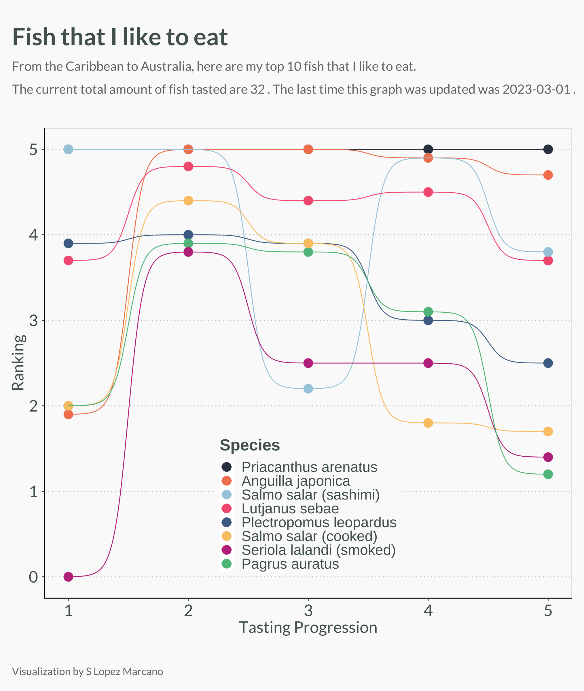

# fish-consumer
"Fish that I like to eat" - Using statistics to understand my preferences for all the fish species that I have eaten in my life. From the Caribbean to Australia, I have scored fish using a wide variety of variables. 

