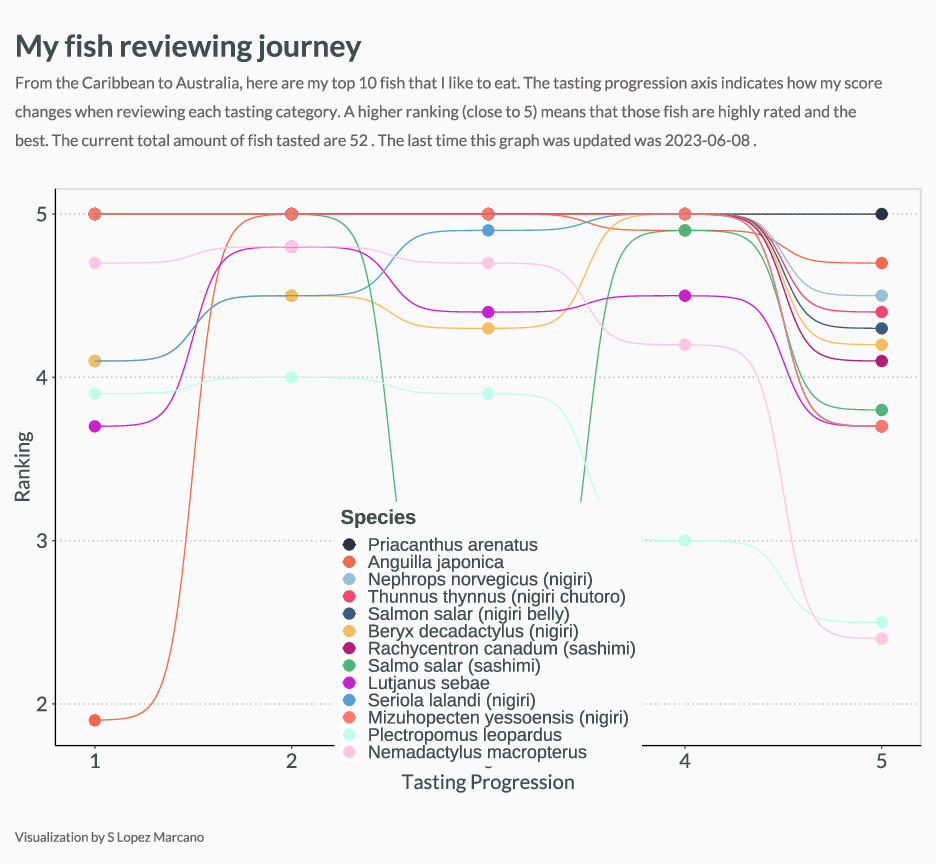
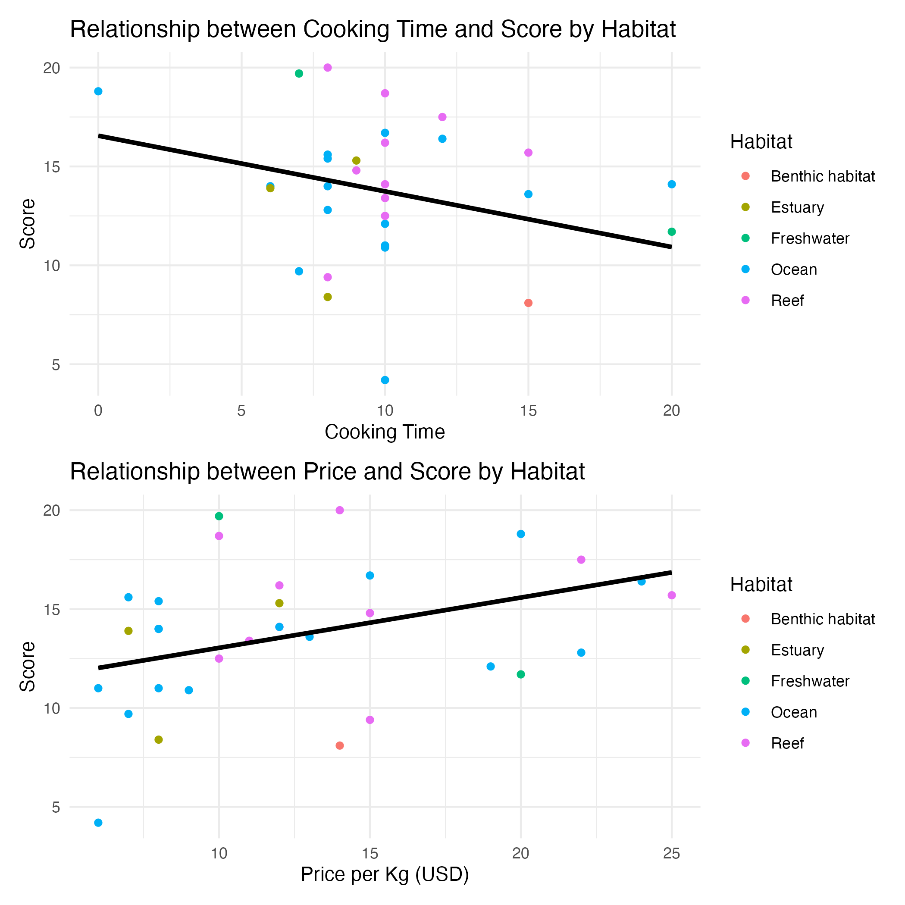

# My fish reviewing journey
"Fish that I like to eat" - Using statistics to understand my preferences for all the fish species that I have eaten in my life. From the Caribbean to Australia, I have scored fish using a wide variety of variables. 

## My Top 10 fish

## Influence of fish habitat, price and cooking time on score
If you see `003_mixed_effect_models.ipynb` you will see that I have a strong preference for fish that have less cooking time and that are more expensive (higher price per kg in USD). While I do not have enought data to measure the influence of habitat, I would expect that I prefer ocean fish better than reef or estuary fish. 

Here is the preliminary plot of my mixed effect model

